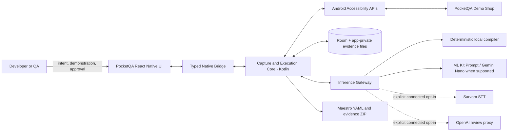

# PocketQA Technical Specification

**Document status:** Build-ready v1.0  
**Product:** PocketQA  
**Team:** Tech Phantoms  
**Primary platform:** Android 11+ (`minSdk 30`)  
**Implementation style:** React Native application with native Kotlin capture, inference, storage, and execution modules  
**Last updated:** 29 August 2026  
**Companion documents:** `PocketQA_PRD.md` and `PocketQA_Mac_Setup_and_New_Developer_Guide.md`

---

## 1. Purpose

This specification defines the architecture, contracts, algorithms, security controls, interfaces, test strategy, and implementation sequence for the PocketQA hackathon build.

It is intentionally opinionated. Its goal is to let the team divide work immediately while preserving one invariant across every module:

> AI can observe and propose. Schema validation and policy decide what is acceptable. Only deterministic code acts.

## 2. System outcomes

The implementation is successful when it can perform this local pipeline on a physical iQOO device:

```text
intent + human demonstration
        ↓
redacted screenshots + normalized UI states + normalized actions
        ↓
schema-valid test draft
        ↓
human review and immutable approval
        ↓
deterministic replay
        ↓
pass/fail evidence + Maestro YAML + export bundle
```

A second, internal-only path adds bounded exploration:

```text
approved mission
        ↓
observe state → build safe candidate set → model/rules rank proposal
        ↓
policy validation → deterministic action → verify transition
        ↓
stop at budget/new state/hard stop → human-reviewable proposal
```

## 3. Architecture decisions

### ADR-001 — React Native for product UI; Kotlin for privileged Android work

**Decision:** Build navigation, forms, test review, evidence timelines, and Mission Control in React Native with TypeScript. Implement AccessibilityService capture, screenshots, UI tree access, node actions, ML Kit, Room, cryptography, and export preparation in Kotlin.

**Reasoning:** This uses the team’s mobile strength while avoiding fragile JavaScript wrappers around Android system APIs. It also lets capture continue while the target app is foregrounded.

**Consequence:** Native-to-JS contracts must be versioned and small. The canonical data format is JSON matching shared schemas.

### ADR-002 — Android API 30 minimum

**Decision:** Set `minSdk 30` for the hackathon app.

**Reasoning:** `AccessibilityService.takeScreenshot()` is available from API 30. Raising the minimum simplifies the most important capture path. PocketQA is a developer tool prototype, so broad consumer-device coverage is not an MVP goal.

### ADR-003 — AccessibilityService backend for the sideloaded prototype

**Decision:** Use an allowlisted AccessibilityService to observe manual events, retrieve window content, take screenshots, and perform deterministic actions.

**Boundary:** Explorer actions are available only in an internal/sideloaded Lab variant. A Play-distributed build must not ship autonomous AccessibilityService planning/execution. The `ExecutionBackend` abstraction must permit a future instrumentation/ADB or OEM-supported backend.

### ADR-004 — Room owns session and evidence metadata

**Decision:** Store structured data through Room in native Android. Store large screenshots and state snapshots as app-private files referenced by Room.

**Reasoning:** The AccessibilityService and executor must persist evidence even when React Native is backgrounded. A native database avoids two writers and bridge round trips for every event.

### ADR-005 — JSON Schema is the canonical cross-layer contract

**Decision:** Store canonical schemas in `packages/schemas`. Validate in TypeScript with Zod/Ajv and in Kotlin with generated/handwritten `kotlinx.serialization` models plus explicit validators.

**Reasoning:** Model output, native bridge events, persistence, export, and tests all need one contract.

### ADR-006 — Deterministic compiler is mandatory

**Decision:** The recorded event trace can always be converted into a basic draft without a generative model. On-device or connected AI may improve naming, assertion ranking, selector explanation, and failure diagnosis.

**Reasoning:** Gemini Nano/ML Kit Prompt availability varies by device. The primary demo cannot depend on model availability or venue connectivity.

### ADR-007 — No production secret inside the APK

**Decision:** Optional Sarvam and OpenAI keys are never hard-coded or placed in committed environment files. The hackathon debug build can accept a runtime developer credential stored with Android Keystore-backed encryption. A production build uses a backend proxy with short-lived authorization.

### ADR-008 — Demo target is a separate team-owned app

**Decision:** Build `PocketQA Demo Shop` as a separate Android package with deterministic fixture reset and accessible IDs.

**Reasoning:** It gives the capture and agent loops a stable, safe surface and avoids private or third-party data.

## 4. System context



## 5. Deployment variants

### 5.1 `internalLabDebug`

- Sideloaded at the hackathon.
- Accessibility capture and deterministic replay enabled.
- Explorer Lab enabled behind an in-app opt-in.
- Runtime connected-provider credential screen available.
- Verbose local diagnostics enabled.
- Uses only Demo Shop in the initial package allowlist.

### 5.2 `internalRelease`

- Sideloaded internal testing build.
- Capture and deterministic replay enabled.
- Explorer configurable by organization policy.
- No debug logs containing raw state.

### 5.3 `playRelease` future variant

- Explorer Lab action execution disabled when AccessibilityService is the backend.
- Requires product/legal review of AccessibilityService eligibility, disclosures, and declaration.
- Connected providers use proxy only.
- Consider replacing execution with exported Maestro tests, instrumentation, managed enterprise device APIs, or an approved OEM developer interface.

## 6. Recommended repository layout

```text
pocketqa/
├── apps/
│   ├── pocketqa-mobile/
│   │   ├── src/
│   │   │   ├── app/
│   │   │   ├── components/
│   │   │   ├── features/
│   │   │   │   ├── onboarding/
│   │   │   │   ├── intent/
│   │   │   │   ├── capture/
│   │   │   │   ├── review/
│   │   │   │   ├── replay/
│   │   │   │   ├── evidence/
│   │   │   │   └── explorer/
│   │   │   ├── native/
│   │   │   ├── store/
│   │   │   └── theme/
│   │   └── android/app/src/main/java/com/techphantoms/pocketqa/
│   │       ├── bridge/
│   │       ├── capture/
│   │       ├── compiler/
│   │       ├── execution/
│   │       ├── explorer/
│   │       ├── inference/
│   │       ├── policy/
│   │       ├── storage/
│   │       └── export/
│   └── demo-shop/
│       ├── app/
│       └── fixtures/
├── packages/
│   ├── schemas/
│   │   ├── test-draft.schema.json
│   │   ├── ui-state.schema.json
│   │   ├── mission.schema.json
│   │   └── evidence.schema.json
│   ├── maestro-exporter/
│   ├── policy-fixtures/
│   └── shared-types/
├── docs/
│   ├── PocketQA_PRD.md
│   ├── PocketQA_Technical_Spec.md
│   └── demo-runbook.md
├── scripts/
│   ├── validate-schemas.sh
│   ├── validate-maestro.sh
│   └── assemble-demo.sh
└── .github/workflows/
    ├── android.yml
    └── contracts.yml
```

For the hackathon, a monorepo is recommended but not mandatory. Do not spend venue time migrating a working codebase solely to match this tree.

## 7. Technology stack

| Layer | Selection | Notes |
|---|---|---|
| Product UI | React Native + TypeScript | Use the team’s standard stable setup and lock versions before venue day. |
| Navigation | React Navigation | Native stack plus bottom tabs only where useful. |
| Client state | Zustand or Redux Toolkit | Zustand is sufficient; Room remains source of truth for sessions. |
| Forms/validation | React Hook Form + Zod | Reuse canonical constraints. |
| Android native | Kotlin + coroutines/Flow | All privileged and background work. |
| Persistence | Room + app-private files | One database writer through repositories. |
| Serialization | `kotlinx.serialization` | Reject unknown critical enum values. |
| Screenshot capture | `AccessibilityService.takeScreenshot` | API 30+; `takeScreenshotOfWindow` on API 34+ when useful. |
| UI hierarchy | `AccessibilityNodeInfo` | Normalize immediately; recycle/avoid retaining platform nodes. |
| OCR | Bundled ML Kit Text Recognition v2 | Bundle Latin model for offline startup; add script models only if demo requires. |
| On-device GenAI | ML Kit Prompt API when available | Capability-check at runtime; structured output where supported. |
| Custom local model | LiteRT/MediaPipe LLM adapter | Stretch; do not block core. |
| Voice | Sarvam WebSocket adapter | Optional, online, intent audio only. |
| Connected analysis | OpenAI Responses API through proxy | Optional; structured output; no device actions. |
| Export runner | Maestro YAML | PocketQA authors; Maestro executes outside PocketQA when desired. |
| Tests | Jest/Vitest, JUnit, Robolectric, Android instrumentation, Maestro | Add contract and safety fixtures early. |

Do not pin unstable versions in this specification. The Gradle catalog, `package.json`, and lockfiles become the dependency source of truth after Gate 0. As of this document, the official ML Kit Prompt guide shows `com.google.mlkit:genai-prompt:1.0.0-beta2`; recheck before locking it.

## 8. Component model

### 8.1 React Native application

Responsibilities:

- navigation and screens;
- intent collection and transcript confirmation;
- readiness and permission UX;
- capture control commands;
- test review and edits;
- approval confirmation;
- replay/Mission Control progress;
- evidence viewing and export initiation;
- provider consent and redacted preview; and
- local settings and deletion.

The React Native layer never receives a live `AccessibilityNodeInfo` object and never performs raw gestures. It receives serialized domain data or summaries.

### 8.2 `PocketQaAccessibilityService`

Responsibilities:

- listen to selected accessibility event types;
- enforce package allowlist before processing;
- obtain active window/root node;
- capture screenshots through the platform API;
- serialize a bounded normalized tree;
- correlate raw events into manual actions;
- expose deterministic node actions to `AccessibilityExecutionBackend`;
- publish active package/window changes; and
- trigger an immediate hard stop on boundary violations.

The service does not invoke a model.

### 8.3 `CaptureCoordinator`

Responsibilities:

- own the capture session state machine;
- debounce raw events;
- determine semantic state boundaries;
- request screenshots and tree snapshots;
- run redaction/OCR/state normalization;
- persist ordered state/action records; and
- emit coarse progress to React Native.

### 8.4 `StateNormalizer`

Responsibilities:

- convert platform node trees into `UiNode` records;
- generate ephemeral node IDs for the current state;
- extract stable semantic tokens;
- normalize text, bounds, roles, flags, and hierarchy;
- compute state fingerprints;
- cap depth/node count while preserving actionable nodes; and
- calculate hierarchy text coverage to decide whether OCR is useful.

### 8.5 `RedactionEngine`

Responsibilities:

- classify sensitive nodes from platform flags, input type, resource IDs, labels, and regexes;
- replace sensitive text before persistence/inference;
- blur corresponding screenshot rectangles;
- produce a redaction report; and
- support user-specified regions before export.

Redaction happens before OCR/model calls wherever possible and before any connected request without exception.

### 8.6 `TestCompiler`

Responsibilities:

- create a deterministic base draft;
- generate and rank selector candidates;
- compute state differences;
- generate grounded assertion candidates;
- ask `InferenceGateway` for optional bounded improvements;
- merge only valid, grounded improvements;
- validate the final `TestDraft`; and
- return warnings and provenance.

### 8.7 `InferenceGateway`

Responsibilities:

- expose task-specific operations instead of a generic chat interface;
- check engine availability;
- build minimal redacted prompts;
- request structured output;
- enforce timeout, size, and retry policy;
- validate responses; and
- route to deterministic fallback.

Supported task types:

- `nameTest`;
- `rankAssertions`;
- `explainSelector`;
- `classifyFailure`;
- `rankSafeExplorerCandidates`; and
- `interpretScreen` optional connected task.

### 8.8 `PolicyEngine`

Responsibilities:

- evaluate every proposed action with no model dependency;
- enforce mode, package, node, action, screen-risk, budget, and approval rules;
- produce an auditable `PolicyDecision`; and
- fail closed on missing context or unknown classifications.

### 8.9 `DeterministicExecutor`

Responsibilities:

- run an approved immutable test or a policy-approved Explorer action;
- observe and verify the current state;
- resolve exactly one target;
- obtain a policy allow decision;
- perform a fixed native operation;
- wait for idle/expected transition;
- evaluate deterministic assertions; and
- persist evidence before advancing.

It cannot call `InferenceGateway` during approved test replay.

### 8.10 `ExplorerAgent`

Responsibilities:

- maintain a bounded local state graph;
- derive safe candidate actions from the observed tree;
- use rules or AI only to rank already filtered candidates;
- ask the policy engine to validate the selected proposal;
- request one action at a time from the executor;
- verify new state and update graph; and
- stop with a human-reviewable proposal.

### 8.11 `EvidenceRepository` and `ArtifactExporter`

Responsibilities:

- persist state/action/assertion traces;
- generate result summaries and artifact checksums;
- create redacted ZIP bundles;
- map approved tests to Maestro YAML;
- expose safe `content://` URIs through `FileProvider`; and
- delete expired or user-deleted evidence.

## 9. State machines

### 9.1 Capture session

```text
IDLE
  → PREPARING
  → RECORDING ↔ PAUSED
  → FINALIZING
  → COMPILING
  → REVIEW_READY
  → APPROVED

Any active state → CANCELLED
Any unrecoverable error → FAILED
```

Rules:

- Only one active session exists.
- State changes are transactional in Room.
- Process restart may resume `PAUSED`, `REVIEW_READY`, or `APPROVED`; it converts orphaned `RECORDING` to `FAILED_INTERRUPTED` after persisting what exists.

### 9.2 Replay

```text
IDLE → PREFLIGHT → RESETTING_FIXTURE → OBSERVING
     → RESOLVING → POLICY_CHECK → ACTING → WAITING → ASSERTING
     → next step or PASSED

Any stage → STOPPED | FAILED | HARD_STOPPED
```

### 9.3 Explorer mission

```text
DRAFT → PLAN_READY → APPROVED → OBSERVING → CANDIDATES_FILTERED
      → RANKED → POLICY_CHECK → ACTING → VERIFYING → GRAPH_UPDATED
      → repeat or PROPOSAL_READY

Any active stage → USER_STOPPED | BUDGET_STOPPED | POLICY_STOPPED | FAILED
```

No state machine transition may be initiated solely by parsing free-form model text. Transitions operate on validated enums and IDs.

## 10. Canonical domain model

IDs are UUIDv7 where available; otherwise UUIDv4. All wall-clock timestamps use ISO 8601 UTC. Durations and ordering use monotonic milliseconds captured separately.

### 10.1 Core enums

```ts
type ExecutionMode = 'AUTHOR_REPLAY' | 'EXPLORER_LAB';

type ActionKind =
  | 'TAP'
  | 'LONG_PRESS'
  | 'TYPE_TEXT'
  | 'CLEAR_TEXT'
  | 'BACK'
  | 'SCROLL'
  | 'WAIT_FOR_IDLE'
  | 'LAUNCH_APP';

type SelectorKind =
  | 'RESOURCE_ID'
  | 'TEST_ID'
  | 'CONTENT_DESCRIPTION'
  | 'TEXT_ROLE'
  | 'HIERARCHY'
  | 'RELATIVE_BOUNDS'
  | 'COORDINATES';

type AssertionKind =
  | 'VISIBLE'
  | 'NOT_VISIBLE'
  | 'ENABLED'
  | 'DISABLED'
  | 'CHECKED'
  | 'TEXT_EQUALS'
  | 'TEXT_CONTAINS'
  | 'STATE_FINGERPRINT'
  | 'IMAGE_REGION_SIMILAR';
```

### 10.2 `IntentSpec`

```ts
interface IntentSpec {
  id: string;
  rawText: string;
  normalizedGoal: string;
  inputMode: 'TEXT' | 'VOICE';
  languageCode?: string;
  targetPackage: string;
  preconditions: string[];
  userNotes?: string;
  createdAt: string;
  transcription?: {
    provider: 'SARVAM' | 'PLATFORM';
    model?: string;
    confirmedByUser: boolean;
  };
}
```

### 10.3 `UiNode`

```ts
interface UiNode {
  nodeId: string;                 // Ephemeral within one state
  parentNodeId?: string;
  childNodeIds: string[];
  packageName: string;
  className?: string;
  role: UiRole;
  resourceId?: string;
  testId?: string;
  text?: string;                  // Already redacted
  contentDescription?: string;    // Already redacted
  hintText?: string;
  bounds: { left: number; top: number; right: number; bottom: number };
  visibleToUser: boolean;
  enabled: boolean;
  clickable: boolean;
  longClickable: boolean;
  editable: boolean;
  password: boolean;
  scrollable: boolean;
  checkable: boolean;
  checked?: boolean;
  selected?: boolean;
  focused?: boolean;
  actions: string[];
  sensitive: boolean;
  sensitivityReasons: string[];
}
```

`UiRole` is a closed set such as `BUTTON`, `TEXT`, `INPUT`, `CHECKBOX`, `RADIO`, `SWITCH`, `IMAGE`, `LIST`, `LIST_ITEM`, `TAB`, `DIALOG`, `LINK`, `UNKNOWN`.

### 10.4 `UiState`

```ts
interface UiState {
  id: string;
  sessionId: string;
  sequence: number;
  capturedAt: string;
  monotonicMs: number;
  packageName: string;
  activityName?: string;
  windowId?: number;
  windowTitle?: string;
  orientation: 'PORTRAIT' | 'LANDSCAPE';
  display: { widthPx: number; heightPx: number; density: number };
  rootNodeId?: string;
  nodes: UiNode[];
  ocrBlocks: OcrBlock[];
  screenshotRef?: string;
  redactionReportRef?: string;
  semanticFingerprint: string;
  imagePerceptualHash?: string;
  captureQuality: {
    treeAvailable: boolean;
    screenshotAvailable: boolean;
    ocrRun: boolean;
    truncatedNodeCount: number;
    warnings: string[];
  };
}
```

### 10.5 `Selector`

```ts
interface Selector {
  id: string;
  kind: SelectorKind;
  resourceId?: string;
  testId?: string;
  text?: string;
  contentDescription?: string;
  role?: UiRole;
  ancestor?: SelectorFragment;
  descendant?: SelectorFragment;
  indexAmongMatches?: number;
  relativeBounds?: { xRatio: number; yRatio: number };
  coordinates?: { x: number; y: number };
  expectedMatchCount: 1;
  score: number;                  // 0..1 from deterministic scoring
  reasons: string[];
  brittle: boolean;
}
```

### 10.6 `ActionStep`

```ts
interface ActionStep {
  id: string;
  order: number;
  kind: ActionKind;
  label: string;
  selector?: Selector;
  fallbackSelectors: Selector[];
  input?: { value: string; redacted: boolean; source: 'CAPTURED' | 'USER_EDITED' };
  waitAfter: WaitCondition;
  sourceBeforeStateId: string;
  sourceAfterStateId?: string;
  grounded: boolean;
  reviewStatus: 'PENDING' | 'APPROVED' | 'EDITED' | 'REJECTED';
  warnings: string[];
}
```

### 10.7 `Assertion`

```ts
interface Assertion {
  id: string;
  order: number;
  kind: AssertionKind;
  selector?: Selector;
  expected?: string | boolean | number;
  evidenceStateId: string;
  source: 'STATE_DIFF' | 'INTENT_MATCH' | 'USER' | 'AI_RANKED';
  grounded: boolean;
  confidence: number;
  rationale: string;
  reviewStatus: 'PENDING' | 'APPROVED' | 'EDITED' | 'REJECTED';
}
```

### 10.8 `TestDraft` and approved test

```ts
interface TestDraft {
  schemaVersion: '1.0';
  id: string;
  sessionId: string;
  name: string;
  intent: IntentSpec;
  target: {
    appId: string;
    appVersionName?: string;
    appVersionCode?: number;
    fixtureId?: string;
  };
  preconditions: Precondition[];
  steps: ActionStep[];
  assertions: Assertion[];
  compileProvenance: CompileProvenance;
  warnings: DraftWarning[];
  validation: { valid: boolean; errors: ValidationIssue[] };
}

interface ApprovedTest extends TestDraft {
  version: number;
  approvedAt: string;
  approvedBy: 'LOCAL_USER';
  immutableHash: string;
}
```

### 10.9 `MissionPolicy`

```ts
interface MissionPolicy {
  schemaVersion: '1.0';
  mode: 'EXPLORER_LAB';
  allowedPackages: string[];
  allowedActions: Array<'OBSERVE' | 'TAP_NODE' | 'BACK' | 'WAIT_FOR_IDLE'>;
  maxActions: number;             // Demo default 3; hard maximum 5
  maxDurationMs: number;          // Demo default 60_000; hard maximum 120_000
  maxUniqueStates: number;        // Demo default 8
  blockSensitiveInputs: true;
  blockCrossPackage: true;
  blockedCategories: RiskCategory[];
  approvedAt: string;
  policyHash: string;
}
```

### 10.10 `PolicyDecision`

```ts
interface PolicyDecision {
  decisionId: string;
  missionOrRunId: string;
  actionProposalId: string;
  result: 'ALLOW' | 'DENY' | 'STOP';
  ruleIds: string[];
  reasons: string[];
  activePackage: string;
  targetNodeId?: string;
  evaluatedAt: string;
  policyHash: string;
}
```

## 11. Canonical test JSON example

```json
{
  "schemaVersion": "1.0",
  "id": "test_0198_demo",
  "sessionId": "session_0198_demo",
  "name": "Coupon survives checkout retry",
  "intent": {
    "id": "intent_0198_demo",
    "rawText": "Verify SAVE20 remains applied after checkout fails and I retry",
    "normalizedGoal": "Coupon SAVE20 remains applied after a simulated checkout retry",
    "inputMode": "TEXT",
    "targetPackage": "com.techphantoms.pocketqa.demoshop",
    "preconditions": ["Demo fixture is reset"],
    "createdAt": "2026-08-29T10:00:00Z"
  },
  "target": {
    "appId": "com.techphantoms.pocketqa.demoshop",
    "fixtureId": "coupon-retry"
  },
  "preconditions": [
    { "kind": "RESET_FIXTURE", "value": "coupon-retry" }
  ],
  "steps": [
    {
      "id": "step_apply",
      "order": 1,
      "kind": "TAP",
      "label": "Apply coupon",
      "selector": {
        "id": "sel_apply",
        "kind": "RESOURCE_ID",
        "resourceId": "com.techphantoms.pocketqa.demoshop:id/applyCoupon",
        "role": "BUTTON",
        "expectedMatchCount": 1,
        "score": 0.98,
        "reasons": ["Stable resource ID", "Observed button role"],
        "brittle": false
      },
      "fallbackSelectors": [],
      "waitAfter": { "kind": "UI_IDLE", "timeoutMs": 5000 },
      "sourceBeforeStateId": "state_before_apply",
      "sourceAfterStateId": "state_after_apply",
      "grounded": true,
      "reviewStatus": "APPROVED",
      "warnings": []
    }
  ],
  "assertions": [
    {
      "id": "assert_coupon",
      "order": 1,
      "kind": "VISIBLE",
      "selector": {
        "id": "sel_save20",
        "kind": "TEXT_ROLE",
        "text": "SAVE20",
        "role": "TEXT",
        "expectedMatchCount": 1,
        "score": 0.90,
        "reasons": ["Directly matches intent", "Visible in captured end state"],
        "brittle": false
      },
      "evidenceStateId": "state_after_retry",
      "source": "INTENT_MATCH",
      "grounded": true,
      "confidence": 0.95,
      "rationale": "The stated behavior requires SAVE20 to remain visible after retry.",
      "reviewStatus": "APPROVED"
    }
  ],
  "compileProvenance": {
    "baseCompiler": "DETERMINISTIC_V1",
    "enhancers": ["MLKIT_PROMPT_IF_AVAILABLE"],
    "networkUsed": false
  },
  "warnings": [],
  "validation": { "valid": true, "errors": [] }
}
```

## 12. Persistence model

### 12.1 Room tables

| Table | Key fields | Purpose |
|---|---|---|
| `capture_sessions` | `id`, `status`, `intent_id`, `target_package`, timestamps | Session lifecycle. |
| `intents` | `id`, encrypted/redacted text, input/provenance | Human goal. |
| `ui_states` | `id`, `session_id`, `sequence`, fingerprints, file refs | Ordered state metadata. |
| `actions` | `id`, `session_id`, sequence, kind, target refs, raw/normalized metadata | Demonstrated actions. |
| `test_drafts` | `id`, `session_id`, JSON, validation status | Reviewable drafts. |
| `approved_tests` | `id`, version, immutable JSON/hash, approved timestamp | Replay authority. |
| `replay_runs` | `id`, test/version, status, policy hash, timestamps | Run lifecycle. |
| `step_results` | `id`, run, step, state refs, status, failure code | Evidence timeline. |
| `assertion_results` | `id`, run, assertion, actual, status | Assertion evidence. |
| `missions` | `id`, goal, policy JSON/hash, status | Explorer lifecycle. |
| `state_graph_nodes` | mission, state fingerprint, visit count | Explorer graph. |
| `state_graph_edges` | mission, from/to, action, result | Explorer transitions. |
| `policy_decisions` | decision ID, run/mission, result, rules, target | Safety audit. |
| `provider_operations` | operation, provider, redaction hash, status, network flag | AI provenance without secrets. |

### 12.2 File layout

```text
files/pocketqa/
├── sessions/<session-id>/
│   ├── states/<sequence>-tree.json.zst
│   ├── screenshots/<sequence>-redacted.webp
│   ├── screenshots-raw/<sequence>.webp
│   ├── redaction/<sequence>.json
│   └── capture-summary.json
├── runs/<run-id>/
│   ├── screenshots/
│   ├── states/
│   └── run-summary.json
├── exports/<export-id>/
│   ├── test.yaml
│   └── evidence.zip
└── temp/
```

Raw screenshots live only in app-private storage and are removed after redaction succeeds unless a developer-only setting retains them for a short period. Never include `screenshots-raw` in export.

### 12.3 Transactions and ordering

- Insert `UiState`, file refs, and associated `Action` within one repository transaction after file writes complete.
- Write files to `.partial`, fsync/close, then atomically rename.
- Store `sequence` as a per-session monotonically increasing integer.
- Use a single `CaptureWriteActor` coroutine to serialize capture writes.

### 12.4 Retention worker

A WorkManager job runs while idle and charging where possible:

- delete cancelled/unapproved raw session artifacts after seven days;
- delete temporary audio immediately after transcription/cancel;
- delete expired run evidence after the configured period;
- preserve approved test JSON until explicit deletion; and
- verify no orphaned files remain after database deletion.

## 13. Android capture implementation

### 13.1 Manifest

Minimum permissions/components:

```xml
<uses-permission android:name="android.permission.RECORD_AUDIO" />
<uses-permission android:name="android.permission.INTERNET" />

<application ...>
    <service
        android:name=".capture.PocketQaAccessibilityService"
        android:permission="android.permission.BIND_ACCESSIBILITY_SERVICE"
        android:exported="true"
        android:label="@string/capture_service_label">
        <intent-filter>
            <action android:name="android.accessibilityservice.AccessibilityService" />
        </intent-filter>
        <meta-data
            android:name="android.accessibilityservice"
            android:resource="@xml/pocketqa_accessibility_service" />
    </service>

    <provider
        android:name="androidx.core.content.FileProvider"
        android:authorities="${applicationId}.files"
        android:exported="false"
        android:grantUriPermissions="true">
        <meta-data
            android:name="android.support.FILE_PROVIDER_PATHS"
            android:resource="@xml/file_paths" />
    </provider>
</application>
```

`INTERNET` remains in the prototype variant for optional providers. Core behavior must not assume it. Do not request microphone permission until the user chooses voice input.

### 13.2 Service metadata

Illustrative configuration:

```xml
<accessibility-service xmlns:android="http://schemas.android.com/apk/res/android"
    android:description="@string/capture_service_description"
    android:accessibilityEventTypes="typeViewClicked|typeViewLongClicked|typeViewTextChanged|typeViewScrolled|typeWindowStateChanged|typeWindowContentChanged|typeWindowsChanged"
    android:accessibilityFeedbackType="feedbackGeneric"
    android:notificationTimeout="100"
    android:canRetrieveWindowContent="true"
    android:canPerformGestures="true"
    android:canTakeScreenshot="true"
    android:accessibilityFlags="flagReportViewIds|flagRetrieveInteractiveWindows|flagIncludeNotImportantViews" />
```

Do not use `typeAllMask` unless diagnostics show a required event is missing. It is noisy and expensive. Set `packageNames` dynamically where supported by updating service info to the currently allowlisted target(s), while retaining a code-level package guard.

### 13.3 Event types and correlation

| Raw signal | Candidate normalized action | Notes |
|---|---|---|
| `TYPE_VIEW_CLICKED` | `TAP` | Strong when source is actionable. |
| `TYPE_VIEW_LONG_CLICKED` | `LONG_PRESS` | Not used by Explorer MVP. |
| `TYPE_VIEW_TEXT_CHANGED` burst | `TYPE_TEXT` / `CLEAR_TEXT` | Collapse changes for same node within 500 ms; never retain password text. |
| `TYPE_VIEW_SCROLLED` | `SCROLL` | Record direction from delta/index; review required if uncertain. |
| Window change without prior event | navigation/state boundary | Not necessarily a user action. |
| Hardware/software back inferred by window transition | `BACK` | Prefer explicit overlay control if inference is uncertain. |

Correlation algorithm:

1. Reject events outside `targetPackage` and PocketQA.
2. Copy only required event/source properties immediately.
3. Add event to a 750 ms correlation window.
4. Group by source stable signature and action category.
5. Emit at most one normalized action for a user gesture.
6. Wait for 350 ms of UI event quiet, with a 2,000 ms maximum.
7. Capture after-state and persist the action edge.
8. Mark uncertainty if the source disappeared or no state transition occurred.

All timing values are configuration constants and must be tuned on the physical device.

### 13.4 Screenshot scheduler

- One centralized queue prevents concurrent platform screenshot calls.
- Minimum interval defaults to 750 ms.
- Priority: pre-action/action evidence > stable state > diagnostic refresh.
- On API 34+, use `takeScreenshotOfWindow` for the target window when an overlay would cover it.
- Scale inference copies to a maximum long edge of 1,024 px; retain export evidence at useful device resolution.
- Encode redacted evidence as lossless WebP or high-quality WebP; do not repeatedly recompress.
- Record platform error codes and continue with tree-only evidence when safe.

### 13.5 UI tree normalization

Traversal rules:

- iterative breadth-first traversal to avoid recursion issues;
- maximum 1,000 nodes and depth 40 for MVP;
- always retain actionable, focused, editable, labeled, and assertion-relevant nodes;
- collapse decorative empty containers after preserving hierarchy relations;
- normalize whitespace and Unicode to NFC;
- remove timestamps/random IDs from fingerprint tokens when recognized;
- store bounds relative to display and parent; and
- never retain platform node objects after serialization.

### 13.6 OCR routing

Run bundled ML Kit OCR only when one of these is true:

- hierarchy has fewer than three meaningful text tokens;
- screenshot contains a large visual region with no corresponding accessible nodes;
- the user’s intent token does not occur in hierarchy text; or
- capture diagnostics explicitly request OCR.

Merge OCR blocks as visual evidence, never as proof of clickability. Match OCR to node bounds when intersection-over-union is high. The hackathon bundle includes Latin recognition; add Devanagari only if a canonical demo UI uses it.

## 14. Redaction design

### 14.1 Sensitive signals

- `AccessibilityNodeInfo.isPassword`.
- Android input type variations for password, phone, email, number, and visible password.
- Resource/label tokens: `password`, `passcode`, `pin`, `otp`, `cvv`, `card`, `account`, `aadhaar`, `token`, `secret`, `auth`.
- Regexes for email, Indian phone number, OTP-like 4–8 digit values, card-like 13–19 digit values with Luhn check, API/JWT tokens, and long IDs.
- User-marked nodes/regions.

### 14.2 Redaction order

1. Classify nodes from metadata before reading/copying text.
2. Replace sensitive text in the normalized tree.
3. Expand node bounds by 4–8 dp and blur/solid-mask screenshot regions.
4. OCR the redacted screenshot, not the raw screenshot.
5. Re-run text regexes on OCR/model payload.
6. Store redaction report and hash.

### 14.3 Known limitation

Visual content not represented by nodes may contain sensitive data. Connected image analysis therefore requires a user-previewed redacted image, even after automated redaction.

## 15. State fingerprinting and diff

### 15.1 Semantic fingerprint

Build a deterministic canonical string from:

- package and stable activity/window identifier;
- orientation;
- ordered actionable-node tuples: role, normalized resource ID, normalized label, enabled/checked state, relative bounds bucket;
- ordered assertion-relevant visible text tokens; and
- selected stable structural edges.

Hash with SHA-256. Exclude exact timestamps, animation frames, cursor position, and known dynamic counters unless intent-relevant.

### 15.2 Visual fingerprint

Compute a perceptual hash from the redacted grayscale screenshot, plus optional region hashes for assertion nodes. Visual equality never authorizes an action; it supports state grouping and regression evidence.

### 15.3 State equivalence

Two states are equivalent for Explorer when:

- package and orientation match;
- semantic fingerprint matches; or semantic similarity exceeds 0.95 and visual Hamming distance is within a tuned threshold;
- no new dialog/blocked-risk category is present; and
- key intent tokens have the same presence/state.

If uncertain, treat states as different. The graph may contain duplicates; unsafe collapsing is worse.

### 15.4 Diff output

```ts
interface StateDiff {
  beforeStateId: string;
  afterStateId: string;
  addedNodes: NodeSummary[];
  removedNodes: NodeSummary[];
  changedNodes: Array<{
    identity: string;
    fields: Array<{ field: string; before: unknown; after: unknown }>;
  }>;
  addedText: string[];
  removedText: string[];
  imageSimilarity?: number;
  transitionConfidence: number;
}
```

## 16. Selector engine

### 16.1 Candidate generation

For a demonstrated target node, generate candidates from:

1. full resource ID;
2. test tag/test ID when exposed;
3. content description and role;
4. exact text and role;
5. normalized text and role;
6. stable ancestor selector plus descendant role/label;
7. stable sibling relation;
8. relative position inside stable list/container; and
9. coordinates as review-only fallback.

### 16.2 Deterministic score

Suggested weights:

| Signal | Score contribution |
|---|---:|
| Unique stable resource/test ID | +0.50 |
| Unique content description | +0.35 |
| Role match | +0.10 |
| Exact text match | +0.25 |
| Stable ancestor context | +0.15 |
| Exactly one match in source state | +0.15 |
| Matches same semantic node in adjacent states | +0.10 |
| Text contains number/time/random token | -0.20 |
| Duplicate matches | -0.30 |
| Position/index dependency | -0.20 |
| Coordinate-only | score capped at 0.25 |

Clamp to `[0, 1]`. The exact value is less important than repeatable ordering and reasons.

### 16.3 Resolution during replay

```kotlin
sealed interface ResolveResult {
    data class Unique(val nodeRef: EphemeralNodeRef, val selectorId: String) : ResolveResult
    data class NotFound(val attemptedSelectorIds: List<String>) : ResolveResult
    data class Ambiguous(val selectorId: String, val candidateCount: Int) : ResolveResult
    data class Unsafe(val ruleIds: List<String>) : ResolveResult
}
```

Resolution order is primary, then approved fallbacks. A fallback can run automatically only if it was present in the approved test and resolves exactly one node. A newly inferred selector is a repair proposal and stops the run.

### 16.4 No stale node references

`nodeId` and platform node references are valid only for one observation. The executor must re-observe and re-resolve immediately before action. Do not persist or act on an `AccessibilityNodeInfo` retained from a prior state.

## 17. Deterministic compiler

### 17.1 Pipeline

```text
load ordered session trace
  → remove duplicate/no-op events
  → convert actions to supported steps
  → generate/rank selectors
  → compute before/after diffs
  → generate grounded assertion candidates
  → score candidates against intent tokens and end state
  → construct base TestDraft
  → optional AI enhancement on compact redacted facts
  → merge only grounded references
  → schema + safety validation
  → review-ready draft
```

### 17.2 Assertion candidate generation

Generate candidates when:

- a visible text/role pair is added after an action;
- a relevant node changes checked, enabled, selected, or text state;
- navigation exposes a stable title or landmark;
- the final state contains exact/semantic intent terms;
- a value like total/discount changes in a deterministic way; or
- the user explicitly marks a node during review.

Filter candidates that are:

- purely decorative;
- transient toast/loading text unless the intent names it;
- dynamic timestamp/session IDs;
- unsupported by a captured state; or
- sensitive.

Require at least one approved end-state assertion.

### 17.3 Intent relevance

For the local deterministic path:

- tokenize normalized intent and UI text;
- retain product entities, error terms, negations, action verbs, and numbers/codes;
- calculate lexical overlap plus simple synonyms (`retry`/`try again`, `discount`/`coupon`/`offer`);
- boost candidates after the final relevant action; and
- never invent expected values absent from intent or evidence.

### 17.4 Optional AI merge rule

An AI response may reference only supplied opaque IDs such as `candidate_assertion_3` or `selector_5`. It may rank, rename, or explain these objects. If it returns a new selector, action, state, expected value, or node not present in supplied evidence, reject that field.

## 18. Inference gateway

### 18.1 Interface

```kotlin
interface StructuredInferenceEngine {
    val engineId: String
    suspend fun status(): EngineStatus
    suspend fun <I : Any, O : Any> generate(
        task: InferenceTask<I, O>,
        input: I,
        timeoutMs: Long
    ): InferenceResult<O>
}

sealed interface InferenceResult<out T> {
    data class Success<T>(val value: T, val provenance: InferenceProvenance) : InferenceResult<T>
    data class Unavailable(val reason: String) : InferenceResult<Nothing>
    data class InvalidOutput(val issues: List<String>) : InferenceResult<Nothing>
    data class Timeout(val elapsedMs: Long) : InferenceResult<Nothing>
    data class Failed(val safeCode: String) : InferenceResult<Nothing>
}
```

### 18.2 Capability routing

```text
task requested
  ├─ is deterministic implementation sufficient? → use it first
  ├─ ML Kit Prompt available and task supported? → on-device structured generation
  ├─ explicit connected consent for this operation?
  │    ├─ voice intent → Sarvam
  │    └─ complex review → OpenAI proxy
  └─ otherwise → deterministic result or feature unavailable
```

The gateway never falls from local to connected automatically.

### 18.3 ML Kit Prompt engine

At readiness:

1. Obtain the generative client.
2. Call the official status API.
3. Represent `AVAILABLE`, `DOWNLOADABLE`, `DOWNLOADING`, and `UNAVAILABLE` distinctly.
4. Allow model download only from an explicit setup action.
5. Cache readiness, but recheck before use.

Generation rules:

- temperature near `0.1–0.2` for ranking/structured tasks;
- one candidate unless a task explicitly compares candidates;
- include only compact redacted state summaries and, when required, one scaled redacted image;
- prefer the official Structured Output API where supported;
- validate with the canonical schema anyway;
- timeout after a task-specific limit, normally 15 seconds; and
- release/cancel the session when the app backgrounds or user stops.

### 18.4 Deterministic engine

`DeterministicInferenceEngine` implements every core operation with rules. It is not a mock; it is the guaranteed baseline and must have unit fixtures.

### 18.5 Custom LiteRT engine stretch

Implement behind the same interface only after the primary demo is stable. Model files are device-specific, large, and may have delegate constraints. The engine must expose download/size/readiness separately and fall back to CPU or deterministic processing without crashing the app.

## 19. Prompt and structured-output design

### 19.1 General prompt envelope

Every generative task receives:

- role: bounded QA analysis component;
- task-specific instructions;
- explicit list of allowed output IDs/enums;
- statement that it cannot execute actions;
- compact redacted evidence;
- JSON schema/structured output contract; and
- instruction to use `INSUFFICIENT_EVIDENCE` instead of guessing.

### 19.2 Assertion-ranking input

```json
{
  "intent": "Coupon SAVE20 remains applied after retry",
  "candidates": [
    {
      "id": "a1",
      "kind": "VISIBLE",
      "fact": "Text SAVE20 visible in state s9",
      "sourceStateId": "s9"
    },
    {
      "id": "a2",
      "kind": "VISIBLE",
      "fact": "Text Network error visible in state s8",
      "sourceStateId": "s8"
    }
  ],
  "allowedCandidateIds": ["a1", "a2"]
}
```

Output:

```json
{
  "ranked": [
    { "candidateId": "a1", "score": 0.98, "reason": "Direct end-state requirement" },
    { "candidateId": "a2", "score": 0.62, "reason": "Confirms the retry precondition" }
  ],
  "insufficientEvidence": false
}
```

Merge rejects any candidate ID not supplied.

### 19.3 Explorer-ranking input

The model never receives arbitrary screen control. It receives a prefiltered array:

```json
{
  "goal": "Find a nearby checkout state we forgot to test",
  "stateSummary": "Cart with SAVE20 applied; simulated checkout available",
  "safeCandidates": [
    { "proposalId": "p1", "label": "Open coupon details", "risk": "LOW", "novelty": 0.8 },
    { "proposalId": "p2", "label": "Return to products", "risk": "LOW", "novelty": 0.3 }
  ],
  "remainingActions": 3
}
```

The output is one `proposalId` or `STOP`. The policy engine re-evaluates it using the live state.

## 20. Policy engine specification

### 20.1 Rule groups

| Group | Example rule IDs |
|---|---|
| Build/mode | `MODE_EXPLORER_DISABLED`, `TEST_NOT_APPROVED` |
| Package | `PACKAGE_NOT_ALLOWLISTED`, `SYSTEM_UI_ACTIVE`, `WINDOW_CHANGED` |
| Target | `TARGET_NOT_FOUND`, `TARGET_AMBIGUOUS`, `TARGET_NOT_VISIBLE`, `TARGET_DISABLED` |
| Sensitive | `PASSWORD_NODE`, `OTP_NODE`, `PAYMENT_SCREEN`, `AUTH_SCREEN`, `PII_INPUT` |
| Consequence | `PURCHASE_ACTION`, `ACCOUNT_MUTATION`, `DESTRUCTIVE_ACTION`, `EXTERNAL_COMMUNICATION` |
| Tool | `ACTION_NOT_ALLOWED`, `COORDINATE_EXPLORER_ACTION`, `UNSUPPORTED_GESTURE` |
| Budget | `ACTION_BUDGET_EXHAUSTED`, `TIME_BUDGET_EXHAUSTED`, `STATE_BUDGET_EXHAUSTED` |
| Approval | `POLICY_HASH_CHANGED`, `MISSION_NOT_APPROVED`, `SCRIPT_HASH_MISMATCH` |
| Device | `SCREEN_LOCKED`, `SERVICE_DISCONNECTED`, `USER_STOPPED` |

### 20.2 Screen-risk classifier

The classifier is deterministic and conservative. It evaluates:

- current package/window type;
- visible/accessible text and resource IDs;
- node input types and flags;
- action label and nearby labels;
- Android permission/system-dialog window indicators; and
- demo app metadata marking actions as safe/blocked in debug builds.

Any match for a high-risk category returns `STOP`. False positives are acceptable in the hackathon build.

### 20.3 Action policy pseudocode

```kotlin
fun evaluate(context: ActionContext): PolicyDecision {
    if (context.userStopRequested) return stop("USER_STOPPED")
    if (context.deviceLocked) return stop("SCREEN_LOCKED")
    if (context.activePackage !in context.policy.allowedPackages) {
        return stop("PACKAGE_NOT_ALLOWLISTED")
    }
    if (!context.approvalHashMatches) return stop("POLICY_HASH_CHANGED")
    if (context.budget.exhausted()) return stop(context.budget.ruleId())
    if (context.action.kind !in context.policy.allowedActions) {
        return deny("ACTION_NOT_ALLOWED")
    }
    val target = context.resolvedTarget ?: return deny("TARGET_NOT_FOUND")
    if (target.matchCount != 1) return deny("TARGET_AMBIGUOUS")
    val risks = riskClassifier.classify(context.state, target)
    if (risks.any { it.severity == HIGH }) return stop(risks.map { it.ruleId })
    return allow("ALL_REQUIRED_RULES_PASSED")
}
```

### 20.4 Audit requirement

Persist every `ALLOW`, `DENY`, and `STOP` decision before attempting the action. A persisted allow decision includes the state fingerprint and ephemeral resolved node signature used for that action.

## 21. Execution backend

### 21.1 Interface

```kotlin
interface ExecutionBackend {
    suspend fun activeContext(): ActiveAppContext
    suspend fun observe(reason: CaptureReason): UiState
    suspend fun resolve(selector: Selector, state: UiState): ResolveResult
    suspend fun perform(action: ConcreteAction): ActionDispatchResult
    suspend fun waitForIdle(condition: WaitCondition): IdleResult
    suspend fun performBack(): ActionDispatchResult
    suspend fun stop()
}
```

### 21.2 Accessibility backend actions

Preferred execution order:

- Tap: `AccessibilityNodeInfo.performAction(ACTION_CLICK)`.
- Long press: `ACTION_LONG_CLICK` if supported.
- Text: `ACTION_SET_TEXT` with approved literal; never Explorer MVP.
- Scroll: semantic `ACTION_SCROLL_FORWARD/BACKWARD`; no free-form gesture in MVP.
- Back: `performGlobalAction(GLOBAL_ACTION_BACK)` after package policy check.
- Coordinate/gesture: approved replay fallback only, debug-visible, never Explorer.

### 21.3 Action verification

An action is not successful because dispatch returned `true`. After dispatch:

1. wait for idle;
2. capture after-state;
3. verify expected package/window;
4. verify semantic fingerprint changed when a transition is expected, or required assertion/wait condition is true;
5. persist result; and
6. only then advance.

### 21.4 Retry policy

- Selector resolution: one fresh observation retry for transient loading.
- Action dispatch: no blind repeated tap.
- If a tap dispatches but no expected event/state change occurs, stop with `ACTION_NO_EFFECT`.
- Assertions use bounded polling based on wait configuration, not model reasoning.

## 22. Explorer Agent design

### 22.1 Candidate construction

From the current state, build candidates only for nodes that are:

- visible and enabled;
- clickable with a semantic action;
- inside the allowlisted package;
- not sensitive;
- not matched by blocked-risk vocabulary/context;
- not a coordinate-only target;
- not known to leave the app; and
- not already traversed from the equivalent state, unless replaying a baseline.

### 22.2 Static risk prefilter

Exclude labels/IDs containing high-risk verbs or nouns such as `buy`, `pay`, `place order`, `confirm`, `submit`, `send`, `delete`, `remove account`, `sign out`, `allow`, `permission`, `install`, `call`, `message`, `share`, `bank`, `card`, `OTP`, and equivalents in supported demo languages.

The Demo Shop exposes explicit debug semantics (`qaRisk="SAFE"|"BLOCKED"`) to make the canonical mission deterministic. PocketQA must still apply generic policy checks.

### 22.3 Ranking

Deterministic base score:

```text
score = 0.40 * novelty
      + 0.25 * intent relevance
      + 0.20 * reversible likelihood
      + 0.15 * selector stability
      - revisit penalty
      - risk penalty
```

On-device AI may reorder safe candidates but cannot add one.

### 22.4 Graph

```ts
interface StateGraphNode {
  fingerprint: string;
  firstStateId: string;
  visitCount: number;
  depth: number;
  intentTokenPresence: string[];
}

interface StateGraphEdge {
  fromFingerprint: string;
  toFingerprint?: string;
  proposalId: string;
  selectorId: string;
  result: 'NEW_STATE' | 'KNOWN_STATE' | 'NO_EFFECT' | 'FAILED' | 'STOPPED';
}
```

### 22.5 Loop

```text
while budget remains:
  observe current state
  if package/risk hard stop: stop
  add or merge state in graph
  build safe candidates using rules
  if none: stop NO_SAFE_ACTION
  rank candidates using deterministic score and optional AI
  re-observe and resolve selected candidate
  evaluate policy and persist decision
  if not ALLOW: stop or remove candidate according to decision
  execute once and verify after-state
  if a useful novel state is found: compile proposal and stop
stop BUDGET_EXHAUSTED
```

### 22.6 Recovery

For the hackathon, the preferred strategy is to stop at the first useful novel state. If recovery is required, use `back()` only when policy predicts it stays within the app; otherwise reset the known fixture and replay the approved baseline. Never ask a model to invent a recovery sequence.

## 23. Failure Detective

### 23.1 Deterministic features

- selector resolution counts;
- last passing state and failing state diff;
- active package/window;
- app process/crash signal when observable;
- wait elapsed vs budget;
- node presence with changed ID/text/role;
- screenshot similarity;
- fixture/reset result; and
- platform capture errors.

### 23.2 Classification rules

| Failure | Minimum evidence |
|---|---|
| Selector drift | Original target absent; one high-similarity node present; expected screen otherwise similar. |
| Assertion regression | Navigation and target actions succeeded; expected state fact absent or changed. |
| Navigation divergence | State fingerprint/window differs significantly before expected screen. |
| Timeout/performance | Expected state appears after or not within deterministic wait budget. |
| App crash | Target process/window disappears with crash signal/log where available. |
| Fixture/environment | Reset failed, precondition missing, or test begins in wrong state. |
| Capture limitation | Tree/screenshot unavailable or service disconnected. |

AI may write the plain-language summary from these facts but cannot override the structured class without evidence.

## 24. Native bridge contract

Use a TurboModule when the selected React Native version and team setup support it cleanly; otherwise use a standard Native Module for the hackathon. Do not spend event time migrating architectures.

### 24.1 Commands

```ts
interface PocketQaNativeModule {
  getReadiness(): Promise<DeviceReadiness>;
  openAccessibilitySettings(): Promise<void>;
  listAllowlistedApps(): Promise<TargetApp[]>;

  startCapture(request: StartCaptureRequest): Promise<{ sessionId: string }>;
  pauseCapture(sessionId: string): Promise<void>;
  resumeCapture(sessionId: string): Promise<void>;
  finishCapture(sessionId: string): Promise<{ draftId: string }>;
  cancelCapture(sessionId: string, deleteArtifacts: boolean): Promise<void>;

  getDraft(draftId: string): Promise<TestDraft>;
  saveDraft(draft: TestDraft): Promise<TestDraft>;
  approveDraft(draftId: string): Promise<ApprovedTest>;

  startReplay(testId: string, version: number): Promise<{ runId: string }>;
  stopReplay(runId: string): Promise<void>;
  getRun(runId: string): Promise<ReplayRunSummary>;

  createMission(input: MissionDraft): Promise<Mission>;
  approveAndStartMission(missionId: string): Promise<void>;
  stopMission(missionId: string): Promise<void>;

  exportTest(testId: string, version: number): Promise<{ uri: string }>;
  exportEvidence(runId: string): Promise<{ uri: string }>;
  deleteSession(sessionId: string): Promise<void>;
  deleteAllData(): Promise<void>;
}
```

### 24.2 Events

```ts
type PocketQaEvent =
  | { type: 'SERVICE_STATUS_CHANGED'; payload: ServiceStatus }
  | { type: 'CAPTURE_PROGRESS'; payload: CaptureProgress }
  | { type: 'CAPTURE_HARD_STOP'; payload: HardStop }
  | { type: 'COMPILE_PROGRESS'; payload: CompileProgress }
  | { type: 'REPLAY_PROGRESS'; payload: ReplayProgress }
  | { type: 'REPLAY_FINISHED'; payload: ReplayRunSummary }
  | { type: 'MISSION_PROGRESS'; payload: MissionProgress }
  | { type: 'MISSION_FINISHED'; payload: MissionSummary };
```

Bridge events are coarse updates. Screens load authoritative data by ID from the native module/Room repository rather than assuming no events were missed.

### 24.3 Error envelope

```ts
interface PocketQaError {
  code: string;
  message: string;        // Safe user-facing message
  recoverable: boolean;
  remediation?: string;
  correlationId: string;
}
```

Never send raw exception stacks or unredacted node text across production UI events.

## 25. React Native application design

### 25.1 Navigation

```text
Root
├── OnboardingStack
│   ├── Welcome
│   ├── Disclosure
│   └── Readiness
└── MainStack
    ├── Home
    ├── NewTest/Intent
    ├── CaptureStatus
    ├── CompileProgress
    ├── ReviewTest
    ├── ReplayMissionControl
    ├── Evidence
    ├── AgentLab
    └── Settings
```

### 25.2 Client stores

- `readinessStore`: service/model/provider status.
- `activeOperationStore`: IDs and coarse live progress only.
- `draftEditorStore`: editable copy, dirty status, validation results.
- `settingsStore`: non-sensitive preferences; provider credentials remain native encrypted storage.

### 25.3 Draft editing

- Load draft and schema version.
- Keep a local editable copy.
- Validate after each material edit with a short debounce.
- Save through native repository with optimistic concurrency (`updatedAt`/revision).
- Approval always reloads and validates the persisted draft.

### 25.4 Mission Control

Always show:

- active package;
- current goal;
- actions used/maximum;
- time remaining;
- last observation/proposal/action;
- hard-stop categories;
- local/connected engine; and
- Stop button.

## 26. Maestro exporter

### 26.1 Mapping

| PocketQA step/assertion | Maestro output |
|---|---|
| Launch/reset fixture | `launchApp` plus optional deep-link/reset command supported by the demo environment |
| Tap by text/ID | `tapOn` selector |
| Type text | `inputText` |
| Back | `back` |
| Scroll | `scrollUntilVisible` or reviewed supported scroll command |
| Visible | `assertVisible` |
| Not visible | `assertNotVisible` |
| Long wait | `extendedWaitUntil` where necessary |
| Unsupported custom assertion | Comment plus evidence; block “fully portable” badge |

### 26.2 Example output

```yaml
appId: com.techphantoms.pocketqa.demoshop
name: Coupon survives checkout retry
---
- launchApp:
    clearState: true
- tapOn:
    id: "com.techphantoms.pocketqa.demoshop:id/firstProduct"
- tapOn:
    id: "com.techphantoms.pocketqa.demoshop:id/addToCart"
- tapOn: "Cart"
- tapOn:
    id: "com.techphantoms.pocketqa.demoshop:id/couponInput"
- inputText: "SAVE20"
- tapOn:
    id: "com.techphantoms.pocketqa.demoshop:id/applyCoupon"
- assertVisible: "SAVE20"
- tapOn: "Continue to simulated checkout"
- assertVisible: "Something went wrong"
- tapOn: "Retry"
- assertVisible: "SAVE20"
- assertVisible: "Discount applied"
```

### 26.3 Export validation

- Serialize through a YAML library; never concatenate unescaped user strings.
- Validate schema/parse locally where feasible.
- Run the canonical generated file with Maestro in CI or the venue laptop before demo.
- Include PocketQA test ID, version, and immutable hash as comments or metadata.
- Mark coordinate selectors and unsupported assertions in an export warnings block.

## 27. Evidence bundle

### 27.1 ZIP manifest

```text
pocketqa-evidence-<run-id>.zip
├── manifest.json
├── test/
│   ├── approved-test.json
│   └── maestro-flow.yaml
├── run/
│   ├── summary.json
│   ├── steps.json
│   ├── assertions.json
│   └── policy-decisions.json
├── states/
│   ├── 001-tree.json
│   └── ...
├── screenshots/
│   ├── 001.webp
│   └── ...
└── diagnosis/
    └── failure.json
```

### 27.2 `manifest.json`

Required fields:

```json
{
  "schemaVersion": "1.0",
  "product": "PocketQA",
  "runId": "run_...",
  "testId": "test_...",
  "testVersion": 1,
  "testHash": "sha256:...",
  "createdAt": "2026-08-29T10:30:00Z",
  "device": {
    "manufacturer": "vivo/iQOO",
    "model": "redacted-or-recorded",
    "androidApi": 0
  },
  "target": {
    "appId": "com.techphantoms.pocketqa.demoshop",
    "versionName": "...",
    "versionCode": 0
  },
  "executionMode": "AUTHOR_REPLAY",
  "networkUsed": false,
  "providers": [],
  "redacted": true,
  "files": [
    { "path": "test/approved-test.json", "sha256": "..." }
  ]
}
```

The actual manufacturer/model values are collected at runtime. The example deliberately does not invent the selected iQOO model.

## 28. Sarvam voice integration

### 28.1 Scope

Sarvam handles intent transcription only. It never receives screenshots, UI trees, test history, or execution evidence.

### 28.2 Flow

1. User taps and holds/starts voice on Intent screen.
2. Request microphone permission if needed.
3. Capture mono 16 kHz PCM/WAV in the foreground.
4. Establish `wss://api.sarvam.ai/speech-to-text/ws` with an `Api-Subscription-Key` header.
5. Use user-selected or `unknown` language code and `codemix`/`transcribe` mode.
6. Stream supported audio frames.
7. Display partial/final transcript where the selected endpoint supports it.
8. User confirms/edits transcript.
9. Delete temporary audio.

### 28.3 Failure behavior

- 3-second connection timeout, operation timeout appropriate to utterance length.
- No automatic retry that re-sends audio without user visibility.
- Fall back to typed intent.
- Provider error logs contain safe code/request ID only.

### 28.4 Credentials

For the event, accept the user’s Sarvam key at runtime in Developer Settings and encrypt it using a Keystore-protected key. Add a one-tap removal action. For production, issue short-lived provider tokens through a backend or proxy requests.

## 29. OpenAI connected review

### 29.1 Allowed use cases

- interpret a difficult redacted screenshot when local tree/OCR is incomplete;
- rank grounded assertion candidates;
- explain a structured failure trace; and
- suggest a test name/summary.

### 29.2 Forbidden use cases

- deciding or dispatching a device action;
- receiving raw unredacted screenshots or secrets;
- silently storing evidence;
- running during airplane/local mode; or
- being a required dependency for compilation or replay.

### 29.3 Recommended production topology

```text
PocketQA → authenticated PocketQA proxy → OpenAI Responses API
```

The proxy:

- stores the API key server-side;
- enforces payload size and allowed task type;
- sets `store: false` where supported/appropriate;
- requests Structured Outputs matching a task schema;
- rejects tool calls except approved analysis-only functions;
- applies timeout/rate limits; and
- returns only validated JSON.

### 29.4 Hackathon direct-debug exception

If there is no time to deploy a proxy, permit a runtime key only in `internalLabDebug`. The app must warn that a mobile client cannot protect a long-lived provider key. Do not compile the key into `BuildConfig`, resources, JavaScript bundle, APK assets, or source control.

### 29.5 Model configuration

Use a remote-config/developer setting `OPENAI_REVIEW_MODEL`; do not hard-code a marketing name throughout the codebase. Select an available multimodal model in the user’s account, verify it before the event, and record the returned model identifier in provenance.

## 30. Demo Shop technical contract

### 30.1 Package and accessibility

- App ID: `com.techphantoms.pocketqa.demoshop`.
- Every actionable control has a stable resource/test ID, label, role, and 48 dp target.
- Important totals/coupon/error states are exposed to accessibility.
- No real network, payment SDK, account, or personal information.

### 30.2 Fixture repository

```kotlin
interface DemoFixtureRepository {
    suspend fun reset(fixtureId: String)
    fun current(): StateFlow<DemoFixtureState>
}

enum class DemoFixtureId {
    CLEAN,
    COUPON_RETRY,
    SELECTOR_DRIFT,
    EMPTY_CART
}
```

Reset can be triggered through a debug-only exported deep-link activity protected by package/signature checks where practical. Disable fixture controls in any non-demo build.

### 30.3 Deterministic simulated failure

The first `Continue to simulated checkout` after `SAVE20` produces a local error state. `Retry` succeeds while retaining the same coupon and total. No call leaves the device.

### 30.4 Intentional drift variant

Keep the resource ID stable but change visible text `Apply coupon` → `Use coupon` to demonstrate an approved fallback or diagnosis. A second variant changes the ID and keeps semantic label similarity to demonstrate a repair proposal that stops before action.

## 31. Performance budgets

| Operation | Target | Hard fallback/limit |
|---|---:|---:|
| Accessibility event processing on main callback | <10 ms | Copy minimal fields then offload. |
| Stable-state debounce | 350 ms quiet | 2,000 ms max. |
| Screenshot request | <750 ms typical | 3,000 ms timeout, tree-only warning. |
| Tree normalization | <250 ms for 1,000 nodes | Truncate with quality warning. |
| Bundled OCR | <1.5 s typical | 4 s timeout; skip on failure. |
| Deterministic compilation | <3 s | 8 s hard target. |
| On-device AI enhancement | <15 s | Cancel and use deterministic draft. |
| Selector resolution | <500 ms | One fresh-observation retry. |
| Wait for UI idle | 350 ms quiet | 5 s default, explicit max 15 s. |
| Stop action propagation | <250 ms | Never dispatch after stop flag. |
| Explorer mission | 60 s / 3 actions | 120 s / 5 actions compile-time maximum. |

Use bounded queues. If capture cannot keep up, drop low-priority intermediate `TYPE_WINDOW_CONTENT_CHANGED` snapshots before dropping action boundary evidence.

## 32. Concurrency and lifecycle

- `CaptureCoordinator` runs in a `SupervisorJob` owned by the service/application process.
- A `Mutex` protects active session transition.
- A single-channel actor serializes screenshot requests.
- A single-channel actor serializes database/file evidence writes.
- Executor and manual capture are mutually exclusive.
- Explorer and approved replay are mutually exclusive.
- `AtomicBoolean stopRequested` is checked before resolution, policy, dispatch, and after waits.
- React Native reload/backgrounding must not cancel native capture; the user can resume UI from persisted operation ID.
- Device lock, service disconnect, target app uninstall/update mid-run, or process loss creates a hard stop/failure with partial evidence.

## 33. Security and threat model

### 33.1 Assets

- screen and UI content;
- test input values;
- evidence files;
- provider credentials;
- approved test integrity;
- action authority; and
- user trust/awareness.

### 33.2 Threats and controls

| Threat | Control |
|---|---|
| Model prompt injection from screen text | Screen text is data, not instructions; task prompt uses opaque candidate IDs; output schema; policy independent of model. |
| Malicious app imitates target | Verify exact package/signature for Demo Shop; package allowlist on every state/action. |
| Stale/changed UI after approval | Fresh observation and target resolution immediately before every action. |
| Model invents node/action | Model can choose only supplied candidate IDs; unknown IDs rejected. |
| Sensitive data in evidence | Node/input classification, screenshot blur, post-redaction scan, user preview. |
| API key extraction | No embedded key; runtime debug credential or production proxy. |
| Export path traversal | Generate internal fixed paths; sanitize display names; use FileProvider/SAF. |
| Tampered approved test | Canonical JSON hash checked before replay; editing creates new version. |
| Replay executes outside package | Active package check before and after each action; immediate stop. |
| Rapid double action | Executor mutex and per-step dispatch token; no retry taps. |
| Background/remote action | No remote trigger, scheduler, push handler, or background mission start. |

### 33.3 Canonical hashing

Serialize approved artifacts with stable key ordering and normalized Unicode. Hash canonical JSON with SHA-256. Store test hash and policy hash in each run and evidence manifest.

### 33.4 Logging

Production-safe logs may include IDs, enum states, durations, counts, and safe error codes. They may not include node text, typed values, screenshots, prompts, provider keys, full response bodies, emails, phone numbers, or auth data.

## 34. Error taxonomy

### 34.1 Setup

- `SERVICE_DISABLED`
- `SCREENSHOT_CAPABILITY_UNAVAILABLE`
- `MODEL_UNAVAILABLE`
- `MODEL_DOWNLOAD_REQUIRED`
- `MIC_PERMISSION_DENIED`
- `PROVIDER_CREDENTIAL_MISSING`

### 34.2 Capture

- `TARGET_PACKAGE_NOT_ACTIVE`
- `PACKAGE_BOUNDARY_VIOLATION`
- `TREE_UNAVAILABLE`
- `SCREENSHOT_FAILED`
- `CAPTURE_INTERRUPTED`
- `ACTION_UNRESOLVED`

### 34.3 Compilation

- `TRACE_EMPTY`
- `DRAFT_SCHEMA_INVALID`
- `MODEL_OUTPUT_INVALID`
- `NO_GROUNDED_ASSERTION`
- `SENSITIVE_VALUE_PRESENT`

### 34.4 Replay/Explorer

- `TEST_NOT_APPROVED`
- `SCRIPT_HASH_MISMATCH`
- `TARGET_NOT_FOUND`
- `TARGET_AMBIGUOUS`
- `TARGET_DISABLED`
- `POLICY_DENIED`
- `ACTION_NO_EFFECT`
- `WAIT_TIMEOUT`
- `ASSERTION_FAILED`
- `ACTION_BUDGET_EXHAUSTED`
- `USER_STOPPED`
- `TARGET_APP_CRASHED`

Each code maps to a user message, recoverability flag, developer details, and evidence class.

## 35. Testing strategy

### 35.1 Unit tests

Must cover:

- text normalization and redaction regexes;
- tree normalization/truncation;
- state fingerprint stability;
- state diff;
- selector candidate generation/scoring;
- selector resolution uniqueness;
- deterministic action correlation;
- assertion candidate generation;
- intent relevance;
- JSON schema validation;
- policy rules and risk vocabulary;
- budget accounting;
- Explorer graph equivalence/ranking;
- Maestro YAML escaping/mapping; and
- canonical hashes.

### 35.2 Contract fixtures

Commit redacted fixture files:

```text
fixtures/
├── states/
│   ├── cart-before-coupon.json
│   ├── cart-after-coupon.json
│   ├── checkout-error.json
│   ├── retry-success.json
│   ├── permission-dialog.json
│   └── payment-like-screen.json
├── compiler/
│   ├── canonical-trace.json
│   └── expected-draft.json
└── model-output/
    ├── valid-ranking.json
    ├── unknown-candidate.json
    ├── malformed.json
    └── prompt-injection-screen.json
```

### 35.3 Native integration tests

- Room migrations and transactions.
- File atomic write/delete.
- Accessibility tree conversion from test nodes.
- Screenshot redaction region transforms.
- Bridge serialization.
- Keystore credential round trip.
- Export URI and ZIP integrity.

### 35.4 Device instrumentation

On emulator and physical iQOO device:

- enable/disable service readiness;
- capture canonical manual flow;
- rotate/background/return where supported;
- lock screen during run;
- switch package during run;
- ambiguous selector fixture;
- no-effect button fixture;
- user stop before dispatch;
- process restart after capture; and
- airplane-mode run.

### 35.5 Safety test matrix

Each blocked category needs a fixture and a test proving no action dispatch:

- purchase/order;
- payment/card;
- account creation/deletion;
- password/OTP;
- permission dialog;
- destructive delete;
- send/share/call/message;
- external browser;
- system settings;
- ambiguous target; and
- unknown screen classification.

Test assertion: `policy decision persisted == STOP/DENY` and `backend.perform invocation count == 0`.

### 35.6 Model evaluation

For each supported AI task, maintain at least 20 compact redacted fixtures. Measure:

- schema-valid response rate;
- unknown-ID/invented-fact rate;
- agreement with expected ranking/classification;
- latency;
- fallback rate; and
- prompt-injection resistance.

The release gate is not “the model usually works.” It is “invalid or unsafe output is always rejected and the baseline still works.”

### 35.7 End-to-end tests

1. Canonical capture → compile → approve → replay → pass → export.
2. Same flow in airplane mode.
3. Selector-drift failure → repair proposal → human-approved new version.
4. Assertion regression with evidence.
5. Explorer discovers one safe novel state and stops.
6. Explorer reaches action budget and stops.
7. Explorer encounters blocked action and dispatches nothing.

## 36. CI and quality gates

Every pull request:

- TypeScript typecheck and lint;
- Kotlin compile, lint/Detekt, and unit tests;
- JSON schema validation;
- golden compiler fixture comparison;
- policy fixture tests;
- Maestro YAML generation and parse check;
- secret scanning; and
- Android debug APK build.

Main branch/nightly where infrastructure permits:

- emulator instrumentation tests;
- install both APKs;
- run generated Maestro canonical flow;
- archive only redacted artifacts; and
- report size/performance regressions.

Before venue demo:

- build signed offline-installable APKs;
- verify hashes;
- run physical-device checklist three times;
- export a known-good evidence ZIP; and
- keep a known-good Git tag/commit and APKs separate from active development.

## 37. Observability and developer diagnostics

The internal diagnostics screen shows:

- service connection and capabilities;
- active target package/window;
- event counts by type;
- capture queue depth;
- last screenshot/tree/OCR latency;
- current session/run/mission IDs;
- inference engine availability and last safe error;
- database/file storage size;
- policy decision counts; and
- network-used flag.

Diagnostics text is redacted. An explicit developer action may export a redacted support bundle.

## 38. Implementation work breakdown

IDs map to the PRD gates and can be copied into GitHub issues.

### Epic E0 — Foundation and Demo Shop

| ID | Task | Depends on | Exit evidence |
|---|---|---|---|
| E0-01 | Bootstrap RN Android app and build variants | None | App launches on iQOO. |
| E0-02 | Add canonical schemas and validators | E0-01 | TS/Kotlin fixture validates. |
| E0-03 | Build Demo Shop canonical states | None | Manual coupon-retry flow. |
| E0-04 | Add fixture reset/deep link | E0-03 | Reset produces known state. |
| E0-05 | Add stable IDs/accessibility metadata | E0-03 | Tree contains all canonical controls. |
| E0-06 | Add CI debug builds and schema checks | E0-01/02 | Green pipeline. |

### Epic E1 — Capture

| ID | Task | Depends on | Exit evidence |
|---|---|---|---|
| E1-01 | Onboarding/readiness UI | E0-01 | Service setup flow. |
| E1-02 | AccessibilityService shell and package filter | E0-05 | Target events only. |
| E1-03 | UI tree normalizer | E1-02/E0-02 | Golden tree fixture. |
| E1-04 | Screenshot scheduler | E1-02 | Redacted screenshot captured. |
| E1-05 | Room/file repositories | E0-02 | Atomic session persistence. |
| E1-06 | Event correlator/action normalizer | E1-02/03 | Ordered canonical trace. |
| E1-07 | Redaction engine | E1-03/04 | Safety fixtures redacted. |
| E1-08 | OCR fallback | E1-04/07 | Missing visual text recovered offline. |
| E1-09 | Native bridge capture commands/events | E1-05/06 | RN displays step count. |

### Epic E2 — Compile and Review

| ID | Task | Depends on | Exit evidence |
|---|---|---|---|
| E2-01 | State fingerprint/diff | E1-03/05 | Golden state diff. |
| E2-02 | Selector generator/scorer | E1-03 | Unique canonical selectors. |
| E2-03 | Deterministic compiler | E1-06/E2-01/02 | Expected draft fixture. |
| E2-04 | Draft validation and provenance | E2-03 | Invalid values blocked. |
| E2-05 | Review/edit UI | E2-04 | User edits and saves. |
| E2-06 | Approval/version/hash | E2-05 | Immutable version created. |
| E2-07 | ML Kit capability/router | E2-03 | Available/unavailable paths shown. |
| E2-08 | Assertion ranking enhancement | E2-07 | Valid response improves ranking; fallback works. |

### Epic E3 — Replay, Evidence, Export

| ID | Task | Depends on | Exit evidence |
|---|---|---|---|
| E3-01 | Policy engine and fixtures | E0-02 | All blocked fixtures deny. |
| E3-02 | Selector resolver | E2-02 | Unique/not found/ambiguous tests. |
| E3-03 | Accessibility execution backend | E1-02/E3-01/02 | One approved tap executes. |
| E3-04 | Replay state machine and stop | E2-06/E3-03 | Canonical script passes. |
| E3-05 | Assertion evaluator | E2-01/E3-04 | Intent assertions pass/fail correctly. |
| E3-06 | Evidence timeline UI | E3-04/05 | Step-by-step run visible. |
| E3-07 | Maestro exporter | E2-06 | YAML parses and runs. |
| E3-08 | Evidence ZIP/checksums | E3-06/07 | Redacted bundle verifies. |
| E3-09 | Airplane-mode E2E | E3-08 | Recorded successful run. |

### Epic E4 — Explorer Lab

| ID | Task | Depends on | Exit evidence |
|---|---|---|---|
| E4-01 | Mission schema and approval UI | E3-01 | Policy hash approved. |
| E4-02 | Candidate filter/risk rules | E3-01/E1-03 | Safe-only candidates. |
| E4-03 | State graph and deterministic ranker | E2-01/E4-02 | Novel state graph fixture. |
| E4-04 | Bounded loop | E3-03/04/E4-03 | Three-action maximum enforced. |
| E4-05 | Candidate test/assertion proposal | E2-03/E4-04 | Reviewable proposal, no auto-save. |
| E4-06 | Mission Control UI | E4-04 | Live budget/stop visible. |
| E4-07 | Physical safety matrix | E4-06 | Zero blocked action dispatches. |

### Epic E5 — Optional connected intelligence

| ID | Task | Depends on | Exit evidence |
|---|---|---|---|
| E5-01 | Runtime credential vault | E0-01 | Key add/remove; no logs. |
| E5-02 | Sarvam voice adapter | E5-01 | Confirmable code-mixed transcript. |
| E5-03 | OpenAI review proxy/adapter | E5-01/E1-07 | Redacted structured review. |
| E5-04 | Failure Detective summary | E3-06/E5-03 optional | Grounded diagnosis with local fallback. |

## 39. Recommended venue sequence

The team should use exit gates, not elapsed-time optimism.

### Before venue

- Finish E0 and as much of E1 as possible.
- Verify exact physical-device behavior.
- Cache Gradle/npm dependencies and model assets.
- Prepare the deterministic compiler fixtures.

### Venue block 1 — Core vertical slice

- Capture only canonical tap/text states.
- Compile with deterministic path.
- Hard-code no product logic, but allow the first UI to show captured facts.
- Reach one approved test quickly.

### Venue block 2 — Replay and evidence

- Implement only semantic click, text, back, and wait.
- Add persistent stop and package checks before any automation.
- Make one pass/fail evidence timeline convincing.

### Venue block 3 — Export and offline proof

- Generate/run Maestro YAML.
- Turn on airplane mode and repeat.
- Freeze a known-good build.

### Venue block 4 — Agentic layer

- Add the tiny Explorer candidate loop.
- Limit it to Demo Shop and three actions.
- Stop on the first useful new state.

### Venue block 5 — Polish only if stable

- Sarvam voice.
- On-device AI labels/ranking.
- Failure explanation.
- Selector repair.

## 40. Definition of technical done

The implementation meets this specification when:

- both APKs build reproducibly;
- the canonical schemas validate in Kotlin and TypeScript;
- all captured artifacts are redacted before inference/export;
- an unsupported on-device model still yields a useful draft;
- approved test hash is checked before replay;
- every action has a persisted policy allow decision;
- ambiguous, sensitive, blocked, or cross-package actions never dispatch;
- replay results are verified from an after-state, not just an API return value;
- an evidence ZIP contains a complete redacted trace and valid checksums;
- generated Maestro YAML executes the canonical flow;
- Explorer cannot exceed its action/time/state budgets;
- user Stop prevents all later dispatches;
- core authoring/replay/export works in airplane mode; and
- the known-good build passes the PRD acceptance matrix on the physical iQOO device.

## 41. Official implementation references

Recheck these before locking dependencies or distributing the app:

- [Android AI/ML solutions overview](https://developer.android.com/ai/overview)
- [Gemini Nano on Android](https://developer.android.com/ai/gemini-nano)
- [ML Kit Prompt API Android setup](https://developers.google.com/ml-kit/genai/prompt/android/get-started)
- [ML Kit Text Recognition v2 for Android](https://developers.google.com/ml-kit/vision/text-recognition/v2/android)
- [AccessibilityService API](https://developer.android.com/reference/android/accessibilityservice/AccessibilityService)
- [AccessibilityServiceInfo API](https://developer.android.com/reference/android/accessibilityservice/AccessibilityServiceInfo)
- [Android accessibility service guide](https://developer.android.com/guide/topics/ui/accessibility/service)
- [Google Play AccessibilityService API policy](https://support.google.com/googleplay/android-developer/answer/10964491)
- [Android UiAutomation API for a future instrumentation backend](https://developer.android.com/reference/android/app/UiAutomation)
- [Gemma mobile deployment options](https://ai.google.dev/gemma/docs/integrations/mobile)
- [Sarvam speech-to-text WebSocket API](https://docs.sarvam.ai/api-reference/speech-to-text/transcribe/ws)
- [OpenAI Responses API](https://developers.openai.com/api/reference/resources/responses/methods/create)
- [Maestro flow overview](https://docs.maestro.dev/maestro-flows)
- [Maestro selectors](https://docs.maestro.dev/api-reference/selectors)
- [Maestro `tapOn`](https://docs.maestro.dev/reference/commands-available/tapon)
- [Maestro `assertVisible`](https://docs.maestro.dev/reference/commands-available/assertvisible)

---

## Appendix A — Preflight algorithm

```text
preflight(test, requestedMode):
  require accessibility service connected
  require device unlocked and screen interactive
  require no other PocketQA operation active
  require target package installed
  require test schema valid
  require test approved and immutable hash matches
  require build variant permits requested mode
  load effective policy and compute policy hash
  require package allowlist contains target only
  require all actions supported in requested backend
  require all input values non-sensitive and approved
  reset fixture if configured and verify reset state
  create run record with test hash and policy hash
  return READY
```

## Appendix B — Replay algorithm

```text
for each approved step in order:
  if stop requested: finish USER_STOPPED
  before = observe(PRE_ACTION)
  require active package is target

  if step has selector:
    result = resolve approved selector/fallbacks against before
    require result is exactly one target

  decision = policy.evaluate(step, before, target, budgets, approval hashes)
  persist decision
  require decision == ALLOW

  dispatch result = backend.perform(concrete approved action)
  if dispatch rejected: fail ACTION_DISPATCH_FAILED

  idle result = waitForIdle(step.waitAfter)
  after = observe(POST_ACTION)
  verify package and expected transition/condition
  persist step result, before/after refs, timings

  evaluate assertions scheduled after this step
  on any failure: stop and generate deterministic diagnosis facts

finish PASSED and build evidence manifest
```

## Appendix C — Hard-stop invariants

These invariants should be encoded as tests and assertions, not comments:

1. No `perform()` call occurs without a persisted `ALLOW` decision for the current state fingerprint.
2. No Explorer model response contains or becomes raw coordinates.
3. No new selector discovered during replay is acted upon before a new test version is approved.
4. No package outside the active allowlist produces a persisted screenshot or action after boundary detection.
5. No password/sensitive plaintext reaches Room, bridge events, inference payloads, logs, or exports.
6. No connected provider is contacted without operation-level consent and a provenance record.
7. No model or network failure prevents deterministic capture, review, replay, and export.
8. No stop request can be followed by a later action dispatch.
